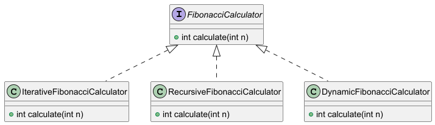
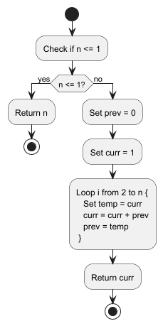
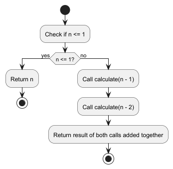
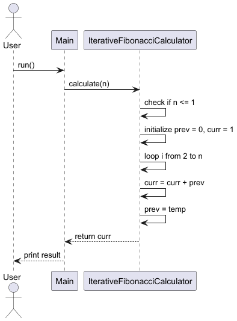
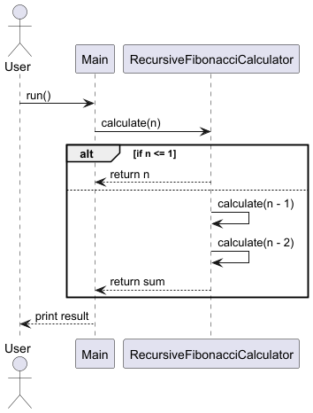
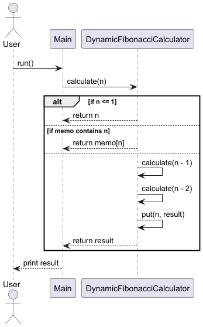

# Fibonacci Calculator

This project provides three implementations of the Fibonacci number calculation: Iterative, Recursive, and Dynamic Programming, each demonstrating different algorithmic approaches and complexities.

## Table of Contents
- [Introduction](#introduction)
- [Features](#features)
- [Technologies Used](#technologies-used)
- [Implemented Algorithms](#implemented-algorithms)
    - [Iterative](#iterative)
    - [Recursive](#recursive)
    - [Dynamic Programming](#dynamic-programming)
- [UML Diagrams](#uml-diagrams)

## Introduction
This project demonstrates three different approaches to calculating the nth Fibonacci number in Java. The purpose is to show how algorithmic design affects performance, complexity, and readability. Each approach is implemented in a separate class and follows clean code and Java best practices.

The project consists of the following algorithm implementations:
1. **Iterative approach** – uses a loop and minimal memory.
2. **Recursive approach** – a straightforward but inefficient method.
3. **Dynamic programming approach** – an optimized recursive version using memoization.

These algorithms demonstrate key concepts such as control flow, recursion, and time/space complexity trade-offs.

## Features
- Modular design using a common interface.
- Three algorithm implementations.
- Unit testing with JUnit 5.
- UML diagrams for better understanding.
- Performance comparison based on execution time.

## Technologies Used
- Java 17
- Maven
- JUnit 5
- PlantUML

## Implemented Algorithms

### Iterative
- **Type:** Bottom-Up Iterative
- **Key Concepts:** Loop, variable swap
- **Time Complexity:** O(n)
- **Space Complexity:** O(1)

### Recursive
- **Type:** Plain Recursion
- **Key Concepts:** Stack frames, divide-and-conquer
- **Time Complexity:** O(2^n)
- **Space Complexity:** O(n) (due to recursion stack)

### Dynamic Programming
- **Type:** Top-Down with Memoization
- **Key Concepts:** Caching, recursion + optimization
- **Time Complexity:** O(n)
- **Space Complexity:** O(n) (due to memoization map)

## UML Diagrams
### Class Diagram
- Fibonacci Class Diagram 
 

### Activity Diagram
- Iterative Fibonacci Activity Diagram 
 

- Recursive Fibonacci Activity Diagram 

- Dynamic Fibonacci Activity Diagram 

### Sequence Diagram
- Iterative Fibonacci Sequence Diagram 

- Recursive Fibonacci Sequence Diagram 

- Dynamic Fibonacci Sequence Diagram 

